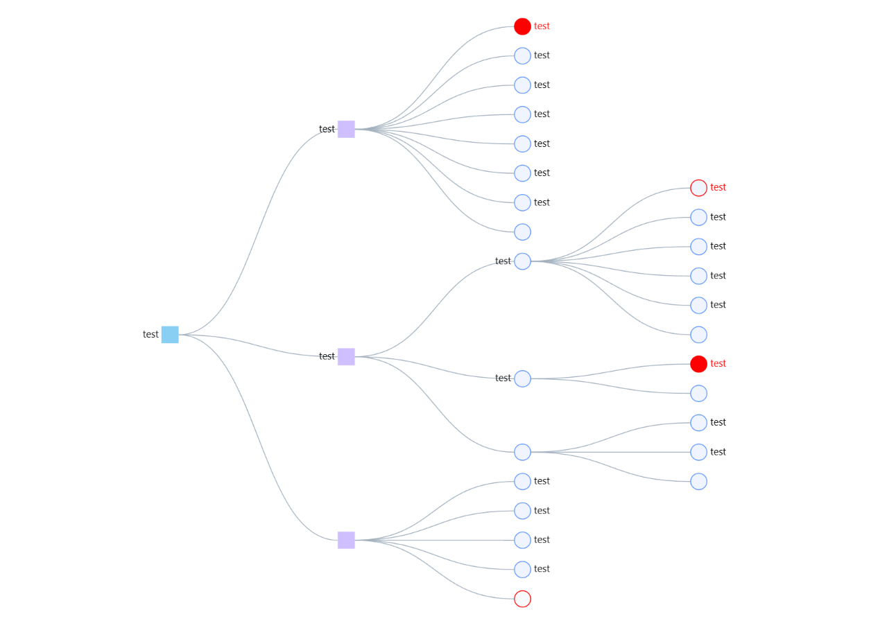

- 背景：


- 需求功能结构图：

- 记录：

1. 轮询

- `setInterval()`设置定时器，`clearInterval()`移除定时器
- `setInterval(func, 2)`每隔两秒放入一个回调函数在任务队列中(刚开始就放)，等待上一个任务执行完成后开始下一个任务，但若是代码实际执行时间远大于设置的间隔时间，就无法两秒就获取一次

```vue
<script>
  function polling() {
    if (!pollingST.value) {
      pollingST.value = setInterval(() => {
        GetMonitor()
          .then((res) => {
            if (res.data.status) {
              if (res.data.error !== "no alert") {
                this.alert();
              }
            } else {
              $q.notify({
                color: "red-5",
                textColor: "white",
                icon: "warning",
                message: res.data.error || "Error",
              });
              if (res.data.error == "permission denied") {
                clearTimeout(pollingST.value);
                $router.push({ path: "/login" });
              }
            }
          })
          .catch((err) => {
            console.error(err);
          });
      }, 2000);
    }
  }
  function logout(){
    // 退出登录时移除定时器
    clearInterval(pollingST.value);
    clearTimeour(pollingST.value);
  }
</script>
```

- `setTimeout(func, 2)` 等两秒后放入一个回调函数在任务队列中（只放一次）,可以递归调用自己

```vue
<script>
var num = ref(0);
var tmp;
function polling(){
    tmp = setTimeout(()=>{
        num.value++;
        ElMessage({
            message: num.value,
            duration: 1000
        })
        polling();
    }, 1000);
}
function closeTimeout(){
    clearTimeout(tmp);
}
onMounted(()=>{
    polling();
})
</script>
```

2. 客制化 G6 图像



- 准备容器

```vue
<template>
  <div ref="container" class="card" style="padding: 0px">
      <div id="graph"></div>
  </div>
</template>
```

- `graph.node(function (node){})` 每个节点进行特殊定制
- `graph.on('node:mouseenter', function (evt)` 设置交互时样式
- `ResizeObserver` 接口监视 Element 内容盒或边框盒或者 SVGElement 边界尺寸的变化。`changeSize`时使用`entry.target.clientWidth`或者`entry.contentRect.width`作为新的画布宽度。最初的想法为：监听windows窗口大小，从而调用`changeSize`来改变画布尺寸；但是侧栏关闭和展开状态切换时窗口没有变化，也就无法生效。

```vue
<script setup>
import G6 from '@antv/g6';

let graph = null;

function PlotG6(data) {
    // 重新绘制
    if (graph) {
        graph.destroy();
    }
    // 采用树图
    graph = new G6.TreeGraph({
        container: 'graph',
        width: container.value.clientWidth,
        height: 650,
        pixelRatio: 2,
        modes: {
            default: [
                {
                    type: 'collapse-expand'
                },
                'drag-canvas',
                'zoom-canvas',
                'drag-node'
            ]
        },
        // 设置默认节点和边
        defaultNode: {
            x: 200,
            y: 200,
            type: 'circle'
        },
        defaultEdge: {
            type: 'cubic-horizontal',
            style: {
                stroke: '#A3B1BF'
            }
        },
        layout: {
            type: 'compactBox',
            direction: 'LR',
            getId: function getId(d) {
                return d.id;
            },
            getHeight: function getHeight() {
                return 16;
            },
            getWidth: function getWidth() {
                return 16;
            },
            getVGap: function getVGap() {
                return 10;
            },
            getHGap: function getHGap() {
                return 100;
            }
        }
    });

    // 每个节点遍历处理
    graph.node(function (node) {
        // console.log(node);
        const nodeType = node.classification;
        const highLight = node.highlight;

        // 特殊节点高亮
        if (highLight) {
            if (nodeType == 'package') {
                return {
                    type: 'rect',
                    size: 20,
                    style: {
                        fill: '#D0BFFF',
                        stroke: 'red'
                    },
                    label: node.name,
                    labelCfg: {
                        position: node.children && node.children.length > 0 ? 'left' : 'right',
                        style: {
                            fill: 'red'
                        }
                    }
                };
            } else if (nodeType == 'project') {
                return {
                    type: 'rect',
                    size: 20,
                    style: {
                        fill: '#89CFF3',
                        stroke: 'red'
                    },
                    label: node.name,
                    labelCfg: {
                        position: node.children && node.children.length > 0 ? 'left' : 'right',
                        style: {
                            fill: 'red'
                        }
                    }
                };
            } else {
                return {
                    label: node.name,
                    style: {
                        stroke: 'red'
                    },
                    labelCfg: {
                        position: node.children && node.children.length > 0 ? 'left' : 'right',
                        style: {
                            fill: 'red'
                        }
                    }
                };
            }
        } else {
            if (nodeType == 'package') {
                return {
                    type: 'rect',
                    size: 20,
                    style: {
                        fill: '#D0BFFF',
                        stroke: '#D0BFFF'
                    },
                    label: node.name,
                    labelCfg: {
                        position: node.children && node.children.length > 0 ? 'left' : 'right'
                    }
                };
            } else if (nodeType == 'project') {
                return {
                    type: 'rect',
                    size: 20,
                    style: {
                        fill: '#89CFF3',
                        stroke: '#89CFF3'
                    },
                    label: node.name,
                    labelCfg: {
                        position: node.children && node.children.length > 0 ? 'left' : 'right'
                    }
                };
            } else {
                return {
                    label: node.name,
                    labelCfg: {
                        position: node.children && node.children.length > 0 ? 'left' : 'right'
                    }
                };
            }
        }
    });

    if (typeof window !== 'undefined') {
        const resizeObserver = new ResizeObserver((entries) => {
            for (const entry of entries) {
                if (!graph || graph.get('destroyed')) return;
                const target = entry.target;

                // 检查容器是否存在且具有有效的宽度和高度
                if (target && target.clientWidth && target.clientHeight) {
                    graph.changeSize(target.clientWidth, 650);
                }
            }
        });

        // 将容器元素添加到 ResizeObserver
        if (container.value) {
            resizeObserver.observe(container.value);
        }
    }

    graph.data(data);
    graph.render();
    graph.fitView();

    // 设置交互效果
    graph.on('node:mouseenter', function (evt) {
        var node = evt.item;
        var model = node.getModel();
        if (!model.conflict) return;
        if (model.conflict.length == 0) return;
        // console.log(model);
        model.oriType = model.style.active.fill;
        // console.log(model.oriType);
        graph.setItemState(node, 'hover', true);
        graph.updateItem(node, {
            style: {
                fill: 'red'
            }
        });
        for (const id of model.conflict) {
            const node = graph.findById(id);
            graph.updateItem(node, {
                style: {
                    fill: 'red'
                }
            });
        }
    });
    graph.on('node:mouseleave', function (evt) {
        var node = evt.item;
        var model = node.getModel();
        // console.log(model);
        if (!model.conflict) return;
        if (model.conflict.length == 0) return;
        graph.setItemState(node, 'hover', false);
        graph.updateItem(node, {
            style: {
                fill: model.oriType
            }
        });
        for (const id of model.conflict) {
            const node = graph.findById(id);
            graph.updateItem(node, {
                style: {
                    fill: model.oriType
                }
            });
        }
    });
}
</script>
```